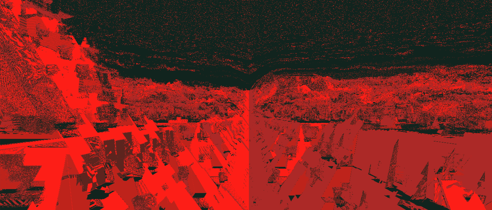

# RAIVE 2024 Summer School



Creative AI Summer School organised by [The Algorithmic Gaze](https://algorithmicgaze.com/).

This repository contains [Figment](https://figmentapp.com/) files and training notebooks for the RAIVE 2024 Summer School.

## Figment

Download the [latest version of Figment](https://figmentapp.com/download/).

If you're new to Figment, you can [watch the tutorial](https://figmentapp.com/docs/tutorials/getting-started) first.

Build a simple hand/face segmentation pipeline using the webcam.


[Example Figment File](figment/face_segmentation_webcam.fgmt)

Save all output files as `.jpg` files in a directory; then create a ZIP file of the directory (On Mac: Right-Click > Compress)

## Training on Colab

The `train_onnx_model_colab.ipynb` notebook contains the code to train a model on Google Colab.

**[Open training notebook in Colab](https://colab.research.google.com/github/algorithmicgaze/raive-2024/blob/main/train_onnx_model_colab.ipynb)**

1. Click the link above
2. Run the first cell by pressing Shift + Enter. You'll get a warning that the notebook was not authored by Google. Click "Run Anyway".
3. Open the "Files" sidebar (click the icon on the left) and drag your ZIP file in the panel.
4. Run all other cells, except for the cell marked as optional (the one that says "curl").
5. After the training has completed, you will see a generator_epoch_XXX.onnx file in the output folder. Click the three dots to download that file, or use the optional steps to copy to Google Drive.

If you have [Colab Pro](https://colab.research.google.com/signup/pricing), the script will execute substantially faster.

## Training On Your Own Machine

The `train_onnx_model_local.ipynb` notebook runs in Jupyter Notebook. Here's some setup to do first:

In the terminal, clone the repository:

```bash
git clone https://github.com/algorithmicgaze/raive-2024.git
cd raive-2024
```

Install the required Python packages:

```bash
pip install -r requirements.txt
```

Run Jupyter notebook:

```bash
jupyter notebook
```

Open the `train_onnx_model_local.ipynb` notebook and follow the instructions.

## Training using the shell

You can also use the command line to train the model. Here's an example:

Install the required Python packages:

```bash
pip install -r requirements.txt
```

Train the model:

```bash
python conditional-gan-pytorch.py --input_dir datasets/trees --output_dir output --epochs 100
```

## Inference

Once the model has trained, you can build a Figment file to load it in. The key node is [ONNX Image Model](https://figmentapp.com/docs/nodes/onnx-image-model) where you can load your model on an input image and get a real-time output.

If you don't have a model yet, you can download a complete prepared model from this link:

Next Steps

Once the model is trained, try feeding in different things than a face. What happens if the lines are hands? Or shapes? Can you scan a drawing with your webcam and control the face that way?

There are some quality improvements you can do too:

- Training for longer can help a lot
- Curating the dataset better might produce better results
